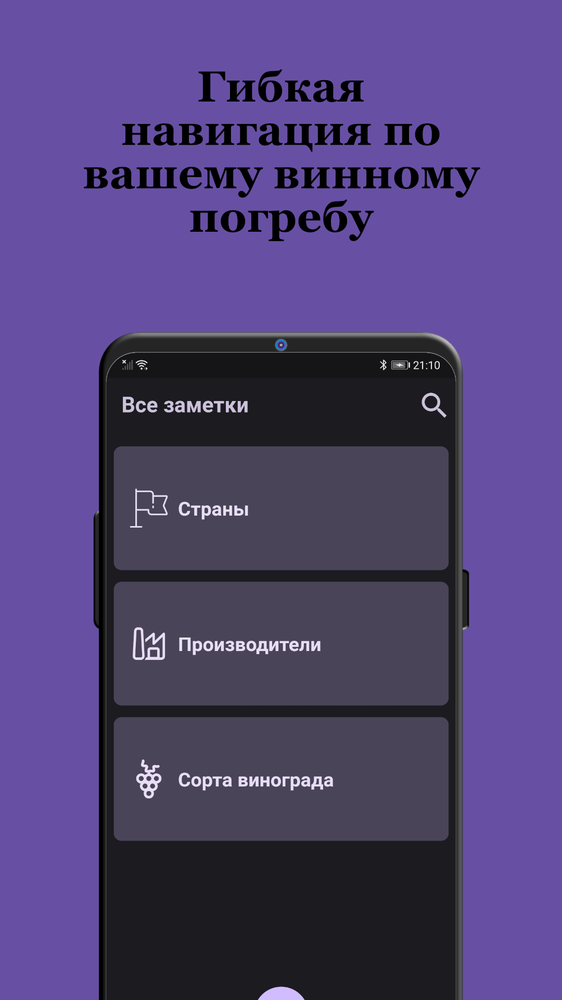
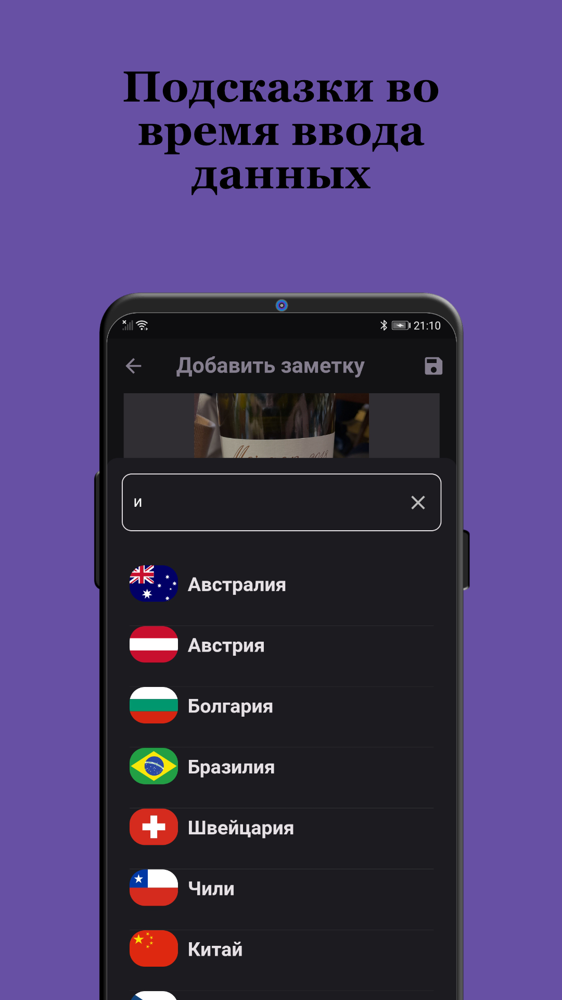
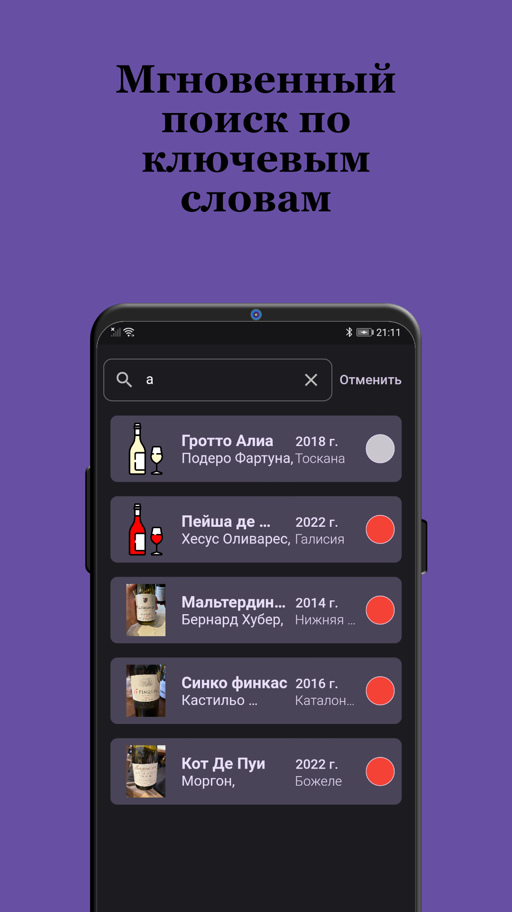
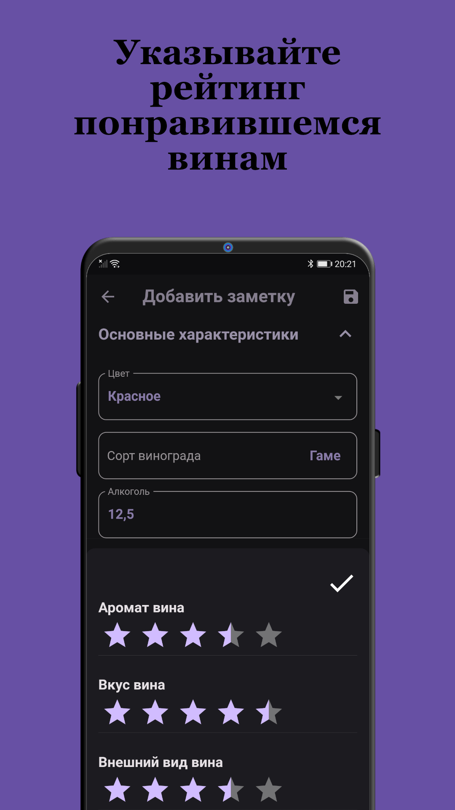

# Дневник сомелье

Приложение для любителей вина, которое позволяет составлять винный погреб прямо в телефоне. 

Создание заметок, их изменение, подсказки ввода, навигация по разделам, поиск заметок.

__Приложение на данный момент успешно протестировано и работает только на платформе Android__

__Google Play Store:__ [Дневник сомельe](https://play.google.com/store/apps/details?id=com.ivanGonch.wineDiary)

   

    

## Используемый стек технологий
### Архитектура 
Вся логика приложения построена через __Provider__. 
### Работа с данными
Все данные записываются локально на устройство для того, чтобы приложением можно было пользоваться оффлайн.  Работа с SQLite осуществляется через плагин [sqflite](https://pub.dev/packages/sqflite).
### Навигация
Навигация производится по rout-маршрутам через __Navigator__. Все маршруты записаны в файле __main__
### Анимация 
Анимированные переходы осуществленны с помощью встроенных средств Flutter. Анимация в приветственном экране приложения построена с помощью пакета [lottie](https://pub.dev/packages/lottie)
### Смена темы
Смены темы прозводится с помощью Provider, а выбор пользователя сохраняется на устройстве, используя [shared_preferences](https://pub.dev/packages/shared_preferences)
### Работа с камерой
Для работы с камерой устройства используется пакет [image_picker](https://pub.dev/packages/image_picker). Обработка выбранных файлов производится через __File__ из библиотеки _dart:io_.

## Примеры работы с приложением

### Видео демонстрация 
[Обзор функций приложения](https://youtu.be/GhL7isuskPo)

## Основные функции в формате GIF с описанием 

### Первичный экран после установки приложения
###

### Cоздание заметки
###

### Автоматическое изменение дефолтного изображения
Изображение изменяется, в зависимости от цвета выбранного вина
###

### Помощь ввода
У разных полей ввода текста, разные помощника ввода. У стран и регионов - подсказку получаем из string_resource. У производителей и поставщиков - берется информация из заметок, которые уже создал пользователь.
###

### Страны и регионы
В приложении заложены самые популярные страны и регионы. При выборе одного из параметров - автоматически подставляется или изменяется другой.
###

### Смена темы
###

### Увеличенные элементы интерфейса
Для удобства - элементы, которые теоретически могут содержать большое количество текста - кликабельны и открывается полное описание
###

### Тап по информации в вине
По тапу на страну/производителя/регион/цвет/сорт можно перейти на список всех заметок, связанных с этим разделом
###

### Поиск заметок
Поиск производится по всем полям во всех заметках одновременно
###

### Фильтрация и сортировка
Доступны несколько видов сортировки и фильтрации заметок
###

### Навигация по заметкам
Навигация производится по следующим разделам: Страны, Производители, Сорта
###

## Установка и работа с приложением 

Приложение протестировано и работает только на базе Android.
Для запуска необходим установленный Flutter, VS Code или Android Studio, эмулятор Android девайса или физическое устройство.
### Последовательность действий
1. Клонирование репозитория с помощью команды `git clone` в терминале.
2. Установка всех зависимостей _pubspec.yaml_ с помощью команды `flutter pub get`
3. Запуск приложения:
 - Либо через компьютер с подключенным физическим устройством или эмулятором. Выполняем в корне приложения команду `flutter run -d <DEVICE-ID>`
 - Либо в корне приложения собираем apk, вызвав команду `flutter build apk`. Файл устанавливаем на физическое устройство с Android OC. 
